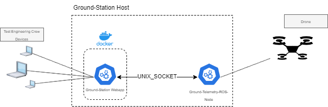

# Ground Station Web-App


This is the Ground-Station-Web-App intended to be used together with the Ground-Station-ROS-Node. This webapp connects to the Ground-Station-ROS-Node via a UNIX socket. Webclients can access a webpage, where all log-messages received on the UNIX-socket get rendered.

# Content

1. [Functionality Overview](#functionality-overview)
2. [Installation](#installation)

# Functionality Overview

This Ground-Station-Web-App serves drone-telemetry-logs to make them accessible for flighttest-crews in their own device's browsers. The backend is implemented using _Node.js_, while the frontend is developed using _React_ and _Vite_. As seen below, the intended deployment shall be using a UNIX-socket for receiving log-messages from a Ground-Telemetry-ROS-Node implemented separately. Preferably the _Docker_ shall be used for hosting this webapp, with the UNIX-socket mounted into the container.


## Accessing the Web-App from a browser

After [installation](#installation) the Web-App clients can access the Web-App through the host. When accessing the site, the client-app connects to the backend's websocket and from there off receives all new log-messages sent from the drone over the Ground-Telemetry-ROS-node. The log messages get printed in a CLI-like way with a preceeding time-stamp of log-receival on the client.

If the log-messages overflow the available space in the browser, the user can scroll through the messages. When scrolling all the way down, the scroll logs onto the newest received message (from there on the scroll sticks down to newest received logs, until the user starts scrolling again).
When the user closes the browser-window, all log-messages on this client are lost. Only again new ones get displayed. Copying important logs before closing the window is advised. Export and similar functionallity may follow in next version.

## UNIX-Socket Message Format

The received data from the UNIX-socket is expected to be **only utf8** encoded JSON in the following format:

```typescript
{
  "type": string,
  "content": string | object
}
```

At the moment the _type_ paramter is ignored. Content gets to be printed as is, either directly as string or as stringified JSON.

# Installation

The Ground-Station-Web-App is intended to be hosted in a _Docker-Container_. Other ways are not officially supported at the moment.

## Image build

After cloning the repository edit at least the [_.env-file_](#environment-variables) for the frontend, as the frontend gets to be build in the first stage of the docker-images building process.
For building the image run the following command in the projects root:

```bash
$ docker build -t <image_name e.g. ground_station> .
```

## Image run

After building a local image use for example the following command to run a container for the Ground-Station-Web-App:

```bash
$ docker run -p <host_port>:<container_port> -v <host_path_to_unix_socket>:<container_path_to_unix_socket> <image_name e.g. ground_station>
```

or use docker-compose:

```yaml
services:
  ground_station:
    image: "ground_station"
    ports:
      - "5000:3000"
    volumes:
      - /tmp/ground_station:/tmp/ground_station
    environment:
      - HTTPS_CERT_PATH=/path/to/https/cert/file.cert
      - HTTPS_KEY_PATH=/path/to/https/key/file.key
      - PORT=3000
      - UNIX_SOCKET_PATH=/tmp/ground_station
```

## Environment Variables

There are two important environment-variable-scopes for this project: front-end environment-varibles and back-end environment-variables. The Frontend-environment-variables need to be set before build of the frontend / build of the docker-image using the _Dockerfile_, as these variables are compiled into the static-site-assets. So edit this file first of all:

### web/frontend/.env

- `VITE_BACKEND` Host of the backend (example: _VITE_BACKEND=192.168.0.5:5000_, assuming the host's IP and port the Web-App is reachable under). This is needed as the front-end needs to connect to the backend's web-socket.

The back-end environment-variables can be set either through the file located under web/backend/.env or using any other ways for setting environment-variables in the final Web-App's container.

### web/backend/.env

- `HTTPS_CERT_PATH` Path to a cert file for using SSL. (Accessible from inside the container)
- `HTTPS_KEY_PATH` Path to a key file for using SSL.

> [!NOTE]  
> If either `HTTPS_CERT_PATH` or `HTTPS_KEY_PATH` or both are not set, SSL is not used.

- `PORT` (_Default: 3000_) Port the Web-App will be listining to inside the container. (This port will likely be mapped to a port on the container's host later)
- `UNIX_SOCKET_PATH` (_Default: /tmp/thi_drone_) Path to the UNIX-Socket for the Web-App to connect to for receiving [messages](#unix-socket-message-format). This path will likly be mounted from outside the container as the Ground-Telemetry-ROS-Node will not be running in the same container.
